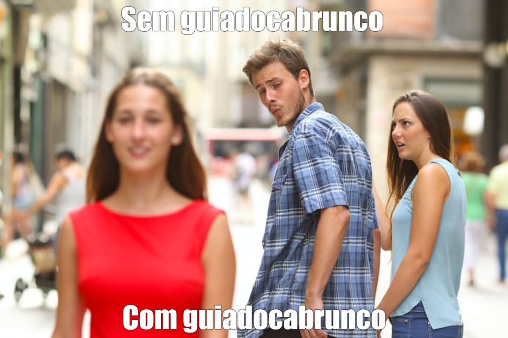

# Cabrunco

Aqui você pode encontrar seus produtos tisgos.

Como funciona ? Cada pessoa pode inserir a sua nota fiscal com o QRCode ou utilizar seu celular para ler um código de 
barra e iserir o valor do produto. A idéia é que a comunidade forneça dados o suficiente , para que você possa realizar 
sua compra mensal de um supermercado, no local que for mais barato.
Como isso acontece ? Através das notas fiscais, iremos coletar o valor de cada produto, mas o ideal é que você possa 
contribuir utilizando o código de barra dos produtos, pois cada supermercado gera um nome diferente para o mesmo produto
na nota e temos que relacionar essa salada de palavras.

Outro meio de contribuir é ajudando no desenvolvimento de robôs que coletam os dados diretamente do site do supermercado.
Aqui nessa documentação você encontrará os supermercados que já fazemos a coleta.

# ATENÇÃO - OBSERVAÇÃO

Como a coleta e inserção de dados são realizados pela comunidade, os preços podem não ser ao realizar a compra, pois podem ocorrer
promoções, mudanças de preço, coleta errada ou outros problemas que não podem ser medidos pela comunidade ! Portanto verifique atentamente
na hora de comprar se confere !
